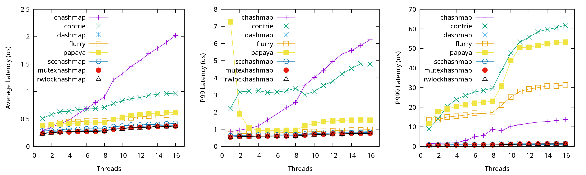

This example shows the latency measurement of the [writeheavy](../writeheavy/)
and [readpopular](../readpopular/) examples. Their descriptions can be found in their own
directories.

AMD Ryzen 9 5950X CPU 0-15 results (writeheavy, [pdf](latency-writeheavy.pdf)):

AMD Ryzen 9 5950X CPU 0-15 results (readpopular, [pdf](latency-readpopular.pdf)):

