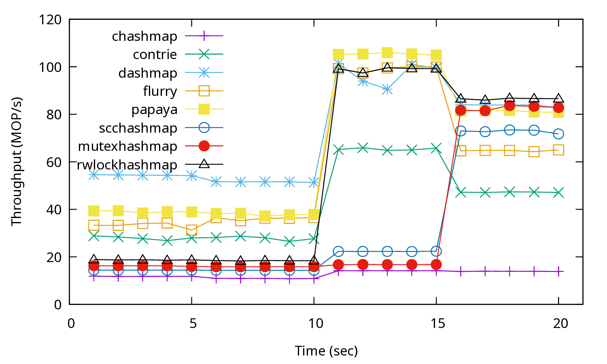

This example shows a benchmark that consists of multiple phases (5 seconds
running time each), benchmarked with 32 threads.

The workload file, `mixed.toml` is as follows:

```toml
[global]
threads = 1
repeat = 5
klen = 8
vlen = 16
kmin = 0
kmax = 1000000
report = "repeat"

[[benchmark]]
set_perc = 100
get_perc = 0
del_perc = 0
repeat = 1
dist = "incrementp"
report = "hidden"

# write-intensive, zipfian
[[benchmark]]
set_perc = 50
get_perc = 50
del_perc = 0
timeout = 1.0
dist = "zipfian"

# write-intensive, zipfian, hotspot in middle
[[benchmark]]
set_perc = 50
get_perc = 50
del_perc = 0
timeout = 1.0
dist = "zipfian"
zipf_hotspot = 0.5

# read-intensive, zipfian
[[benchmark]]
set_perc = 5
get_perc = 95
del_perc = 0
timeout = 1.0
dist = "zipfian"

# read-only, uniform
[[benchmark]]
set_perc = 0
get_perc = 100
del_perc = 0
timeout = 1.0
dist = "uniform"
```

In the first phase, all worker threads fill the key space of the store, and the metrics are hidden.
Then, the benchmark consists of 4 parts with 5 seconds running time each:

- Write-intensive on popular keys.
- Write-intensive on popular keys while the popular keys shifted to the middle of the
key space.
- Read-intensive (only 5% writes) on popular keys.
- Read-only on uniformly random keys.

The script file `run.sh` runs this benchmark against multiple stores with 32 threads.
Although the number of threads set in the configuration file is only 1, the number of threads are
dynamically adjusted by setting `global.threads` to 32.

AMD Ryzen 9 5950X CPU 0-15 results ([pdf](mixed.pdf)):


