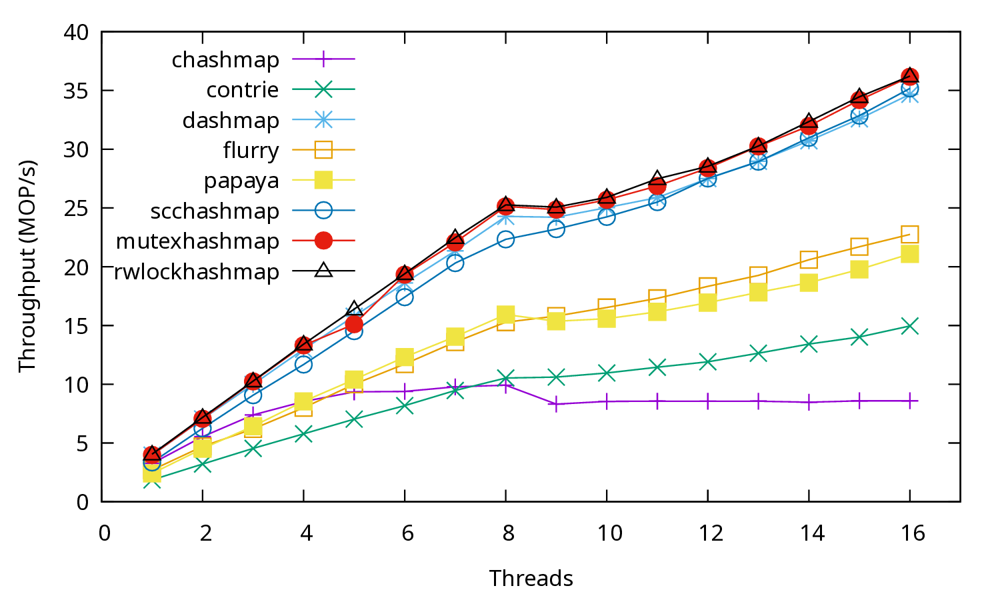

This example shows a benchmark that mixes reads and writes at 1:1 ratio accessing a random record
in the store, running with different number of threads.

The workload file, `writeheavy.toml` is as follows:

```toml
[global]
threads = 1
repeat = 1
klen = 8
vlen = 16
kmin = 0
kmax = 1000000

[[benchmark]]
set_perc = 100
get_perc = 0
del_perc = 0
repeat = 1
dist = "incrementp"
report = "hidden"

[[benchmark]]
timeout = 1
set_perc = 50
get_perc = 50
del_perc = 0
dist = "uniform"
report = "finish"
```

In the first phase, all worker threads fill the key space of the store, and the metrics are hidden.
In the second phase, worker threads execute the write-heavy workload for 1 second and report once
when finished.

The script file `run.sh` runs this benchmark against multiple stores with different number of
threads. The number of threads are dynamically adjusted via `global.threads` environment variable.

5950X CPU 0-15 results ([pdf](writeheavy.pdf)):


