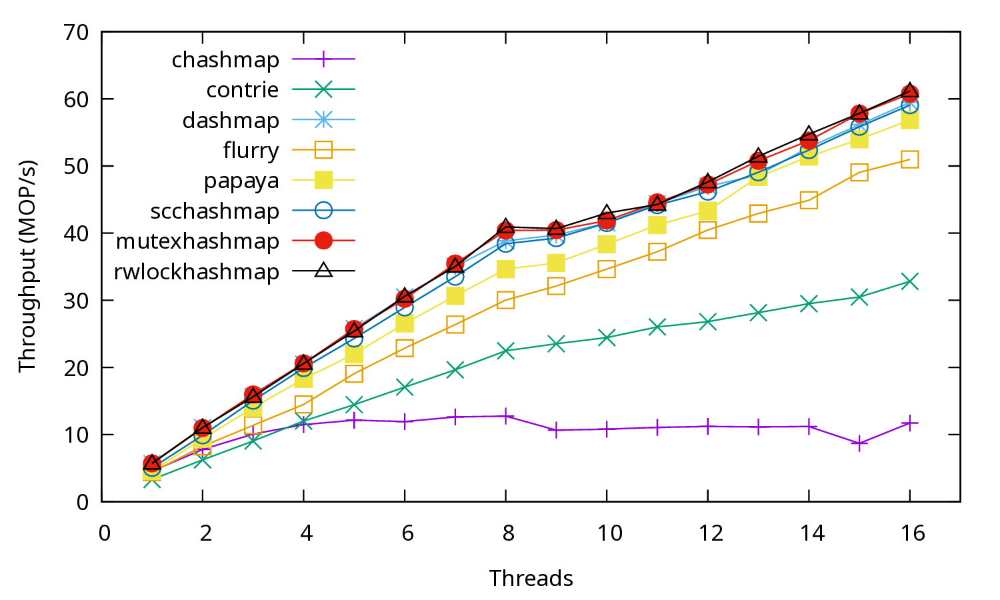

This example shows how to run YCSB-like benchmarks in kvbench by utilizing its customizable
workloads. Here we simulate the YCSB-D workload where there are 5% inserts/writes and 95% reads.
The key distribution still follows Zipfian but the hotspot is always the latest written key.

Unlike YCSB that really inserts a key, kvbench assumes a fixed-sized key space, and a write
operation can be either an insert or an update internally. For the latest key, it should not make
a huge difference as it's usually cached.

The workload file, `ycsbd.toml` is as follows:

```toml
[global]
threads = 1
repeat = 1
klen = 8
vlen = 16
kmin = 0
kmax = 1000000

[[benchmark]]
set_perc = 100
get_perc = 0
del_perc = 0
repeat = 1
dist = "shufflep"
report = "hidden"

[[benchmark]]
timeout = 3
set_perc = 5
get_perc = 95
del_perc = 0
dist = "latest"
report = "finish"
```

In the first phase, all worker threads fill the key space of the store, and the metrics are hidden.
Note that the loading is done using `shufflep` instead of `incrementp`. With `shufflep`, the order
of the keys in the key space is shuffled and each key is written exactly once.
In the second phase, worker threads execute the workload using the built-in `latest` key
distribution.

The script file `run.sh` runs this benchmark against multiple stores with different number of
threads. The number of threads are dynamically adjusted via `global.threads` environment variable.

AMD Ryzen 9 5950X CPU 0-15 results ([pdf](ycsbd.pdf)):


